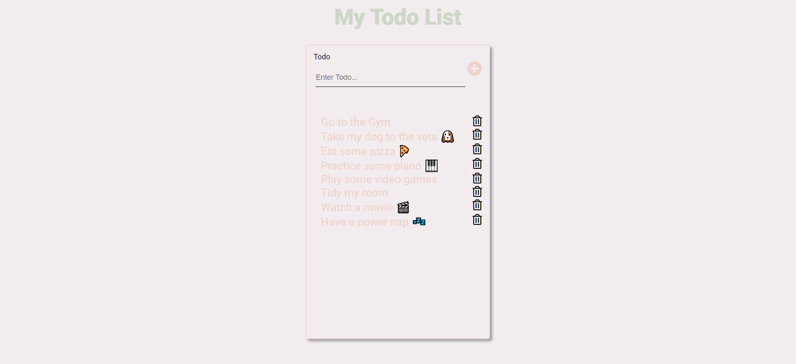

# Todo App

## Screenshot

## Preview url: [https://aron-react-todo-app.netlify.app/](https://aron-react-todo-app.netlify.app/)

## Currently learning react and wanted to build a mini project to solidify my knowledege on the below topics 

- Events
- Array & Object destructuring
- Passing functions as props
- State
- Immutability
- Forms
- Lifting state up

### Continued development

- useEffect Hook - 20/06/2021 - added the amount of todos in the title of the bowser tab. 
- localStorage API - 21/06/2021 - added persisting to localStorage. Learnt about initial Lazy state which is when you pass a function to the useState hook which is only run once. We only want to retrive from local storage once not on every re render as localStorage API is syncronous. 
 

